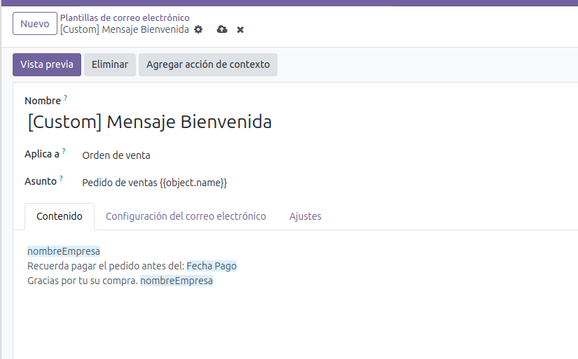
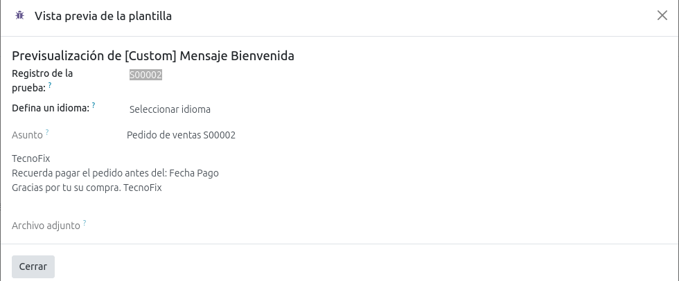
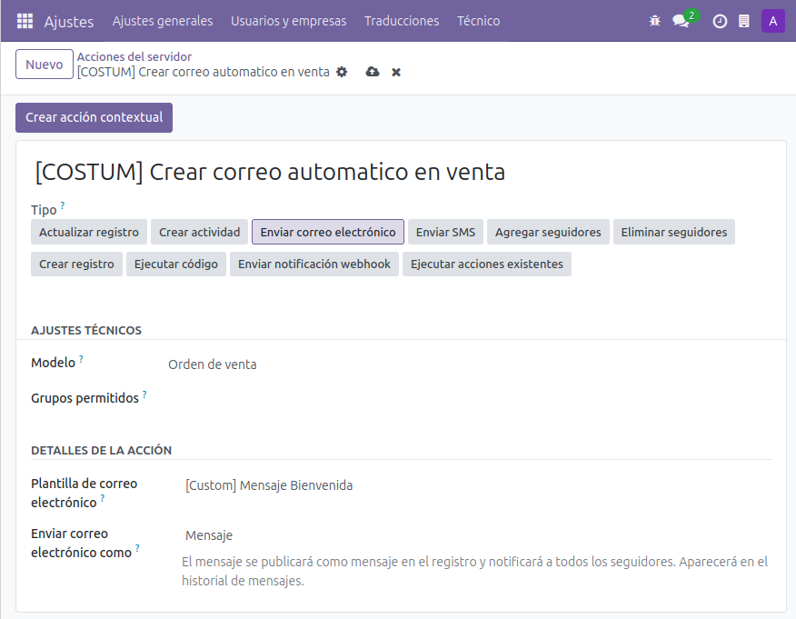

# Sistemas de Gestión Empresarial 

## 1. Personalizar correo de bienvenida

Para ello vamos a necesitar los siguientes pasos

- Lo primero que tenemos que hacer es ponerlo en modo desarrollador
- Accedemos a las plantillas del correo electrónico y creamos una nueva

- En aplicar a : Orden de ventas
- Asunto: pedido de venta
- Contenido: 
    nombreEmpresa 
    Recuerda pagar el pedido antes del: Fecha Pago
    Gracias por tu su compra. nombreEmpresa

Donde esta nombreEmpresa y Fecha Pago, nos saldran los datos que queremos visualizar, sin tener que poner como object.name o object.partnner_id.name , para que quede más visual a la hora de escribirla.

Nos tendria que quedar así

*Para poder ver la fecha de pago primero habrá que ponerla en el pedido*

Para poder visualizarlo solo tenemos que darle a vista previa, que en mi caso se verías así

### 1.1 Mandarlo manualmente 
Para que funcione nos tenemos que ir a ventas y medidos de ventas y al enviar un mensaje nuevo tendremos que selecionar la plantilla que acabamos de crear [Costum] Mensaje Bienvenida. (sale en la parte de abajo).

### 1.2 Mandarlo automatizado
Si automatizamos el mensaje cada vez que nos hagan un pedido se enviará automaticamente y no tendremos que enviarla cada vez, para ello debemos de seguir los siguientes pasos
- Tenemos que ponerlo en modo desarrollador si no lo tenemos ya
- Y dentro de tecnico nos metemos en acciones de servidor y creamos uno nuevo
    - Le ponemos un nombre, en este caso [COSTUM] Crear correo electronico automatico en venta
    - En el tipo seleccionamos: Enviar como electrónico
    - Modelo: Orden de ventas
    - Grupos permitidos, este campo lo vamos a dejar en vacio pero sirve para restringir la entrada a las personas que necesiten este campo.
    - En la plantilla de correo electronico ponemos la que habiamos creado [Costum] Mensaje de Bienvenida
    - Y en enviar correo electrónico como, lo dejamos como mensaje.

Nos quedaría una cosa asi

Ahora cada vez que confirmemos el pedido se tiene que generar automaticamente esta acción, pero aun nos queda un paso que es crear la automatización. Para ello debemos hacer los siguiente:
- Nos tenemos que ir a aplicaciones, borrar lo que nos sale por defecto y buscar autom, y  **activamos base_automation**
- Volvemos a tecnico y nos ponemos en regla de automatización

Volvemos al tecnico y nos ponemos en reglas de automatizacion, 
Creamos una nueva
    Nombre: envío mail venta automatica
    Modelo: pedido de ventas
    Activador: El estado esta establecido como - orden de venta
    Lo demás lo dejamos igual.
    Ejecitar acciones existentes
    Y seleccionamos lo que habiamos creado

Se pone en modo desarrollador 
Accedemos a plantillas de correo
creamos una nueva
aplica a : Orden ventas
asunyo : pedido de venta
	Para personalizar el asunto hay que hacerlo en contenido, y que ponerlo igual pero con dos {}, es decir, {{ object.name }}
contenido : en el mensaje / y entrar en el antepenultimo # (Marcador de posición dinamico)
cliente (cliente parner id, nombre) = object.partnner_id.name
recuerda pagarlo antes de : object.payment_term_id.name (para esto hay que ponerle condicion de pago al pedido )
gracias por tu pedido object.name

Para ponerla si nos ibamos a ventas y pedido de ventass y mensaje nuevo se puede seleccionar la plantilla que acabamos de crear (en la parte de abajo).

Automatizarlo, para que cada vez que hagamos un pedido salga
Dentro de tecnico nos metemos en acciones de servidor, una vez dentro
Generamos una nueva:
    Lo llamamos crear correo electro, automa. en venta
    En tipo seleccionamos: enviar como electronico
    Modelo: pedido de ventas
    Grupos permitidos: 
    Plantilla de correo electronico: La que hemos creador
    Enviar correo electronico como mensaje 
Y guardamos la accion 
Ahora cuando confirmemos el pedido se tiene que generar automaticamente esta acción
Todavia no sale, por lo que hay que crear la automatizacion
Nos vamos a aplicaciones y buscamos autom
y seleccionamos base_automation
Volvemos al tecnico y nos ponemos en reglas de automatizacion, 
Creamos una nueva
    Nombre: envío mail venta automatica
    Modelo: pedido de ventas
    Activador: El estado esta establecido como - orden de venta
    Lo demás lo dejamos igual.
    Ejecitar acciones existentes
    Y seleccionamos lo que habiamos creado
