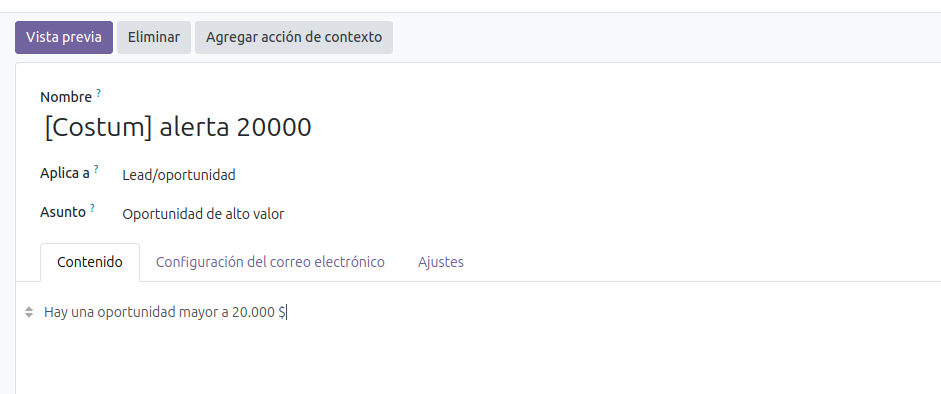
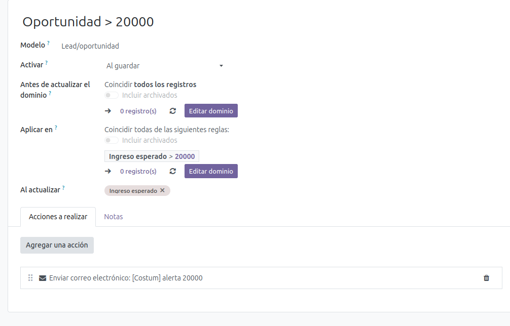
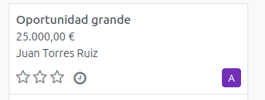
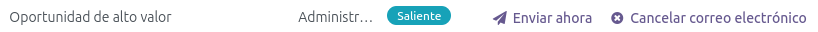
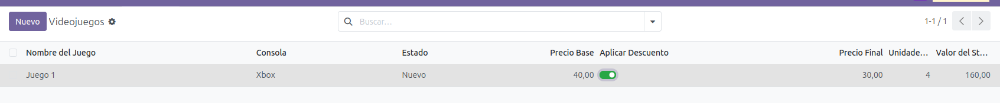
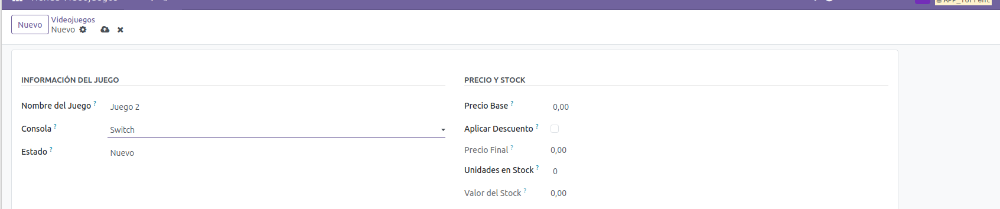

# Prácticas de Odoo

## Ejercicio 1: Mail Automático

### Objetivo
Crear una automatización que detecte cuando se crea una oportunidad de venta mayor a 20.000€ y envíe automáticamente un correo electrónico de notificación al equipo de ventas.

### Paso 1: Crear la Plantilla de Correo Electrónico

Primero vamos a crear una plantilla de email automático para cuando tengamos una oportunidad mayor a 20.000€. Lo que queremos es que nos llegue una notificación.

**Ruta:** Ajustes → Técnico → Correo electrónico → Plantillas de correo



### Paso 2: Crear la Automatización

Ahora vamos a crear una automatización para que se ejecute automáticamente cuando se cumpla la condición:

**Ruta:** Ajustes → Técnico → Automatización → Acciones automatizadas

**Configuración:**
- **Modelo:** Lead/Oportunidad (crm.lead)
- **Disparador:** Al crear y actualizar
- **Dominio:** Ingreso esperado > 20000
- **Acción:** Enviar correo electrónico (usando la plantilla creada)



### Paso 3: Crear una Oportunidad de Prueba

Creamos una oportunidad con un valor superior a 20.000€ para probar que la automatización funciona correctamente:



### Paso 4: Verificar el Envío del Correo

Para comprobar que nos funciona, nos metemos en los correos electrónicos recibidos y nos tiene que salir algo así:

**Ruta:** Ajustes → Técnico → Correo electrónico → Correos electrónicos



---

## Ejercicio 2: Tienda de Videojuegos

### Objetivo
Crear un módulo personalizado en Odoo para gestionar el inventario de una tienda de videojuegos con cálculos automáticos de precios y valoración de stock.

### Características del Módulo

- **Gestión de videojuegos** por consola (PS5, Xbox, Switch, PC)
- **Control de stock** y estado (Nuevo/Segunda Mano)
- **Cálculo automático** del precio final con descuentos de 10€
- **Valoración del inventario** (precio × unidades)

### Vista XML

El archivo de vistas define la interfaz de usuario del módulo, incluyendo:
- **Formulario** de creación/edición
- **Vista de lista** con todos los campos
- **Filtros de búsqueda** por descuento, stock y agrupaciones

**Archivo:** `views/videojuego_views.xml`

```xml
<?xml version="1.0" encoding="utf-8"?>
<odoo>
    
    <!-- Vista de Formulario -->
    <record id="view_videojuego_form" model="ir.ui.view">
        <field name="name">tienda.videojuego.form</field>
        <field name="model">tienda.videojuego</field>
        <field name="arch" type="xml">
            <form string="Videojuego">
                <sheet>
                    <group>
                        <group string="Información del Juego">
                            <field name="nombre" placeholder="ej. The Legend of Zelda"/>
                            <field name="consola"/>
                            <field name="estado"/>
                        </group>
                        <group string="Precio y Stock">
                            <field name="precio_base"/>
                            <field name="descuento"/>
                            <field name="precio_final" readonly="1"/>
                            <field name="unidades"/>
                            <field name="valor_stock" readonly="1"/>
                        </group>
                    </group>
                </sheet>
            </form>
        </field>
    </record>

    <!-- Vista de Lista -->
    <record id="view_videojuego_tree" model="ir.ui.view">
        <field name="name">tienda.videojuego.tree</field>
        <field name="model">tienda.videojuego</field>
        <field name="arch" type="xml">
            <list string="Videojuegos">
                <field name="nombre"/>
                <field name="consola"/>
                <field name="estado"/>
                <field name="precio_base"/>
                <field name="descuento" widget="boolean_toggle"/>
                <field name="precio_final"/>
                <field name="unidades"/>
                <field name="valor_stock"/>
            </list>
        </field>
    </record>

    <!-- Vista de Búsqueda -->
    <record id="view_videojuego_search" model="ir.ui.view">
        <field name="name">tienda.videojuego.search</field>
        <field name="model">tienda.videojuego</field>
        <field name="arch" type="xml">
            <search string="Buscar Videojuegos">
                <field name="nombre"/>
                <field name="consola"/>
                <field name="estado"/>
                <filter string="Con Descuento" name="con_descuento" domain="[('descuento', '=', True)]"/>
                <filter string="Sin Stock" name="sin_stock" domain="[('unidades', '=', 0)]"/>
                <group expand="0" string="Agrupar Por">
                    <filter string="Consola" name="group_consola" context="{'group_by':'consola'}"/>
                    <filter string="Estado" name="group_estado" context="{'group_by':'estado'}"/>
                </group>
            </search>
        </field>
    </record>

    <!-- Acción de Ventana -->
    <record id="action_videojuego" model="ir.actions.act_window">
        <field name="name">Videojuegos</field>
        <field name="res_model">tienda.videojuego</field>
        <field name="view_mode">list,form</field>
        <field name="help" type="html">
            <p class="o_view_nocontent_smiling_face">
                Crea tu primer videojuego
            </p>
            <p>
                Haz clic en "Crear" para agregar un nuevo videojuego al inventario.
            </p>
        </field>
    </record>

    <!-- Menús -->
    <menuitem id="menu_tienda_videojuegos_root"
              name="Tienda Videojuegos"
              sequence="10"/>

    <menuitem id="menu_videojuegos"
              name="Videojuegos"
              parent="menu_tienda_videojuegos_root"
              action="action_videojuego"
              sequence="10"/>

</odoo>
```

### Modelo Python

El modelo define la estructura de datos y la lógica de negocio del módulo.

**Campos básicos:**
- `nombre`: Título del videojuego
- `consola`: Plataforma (PS5, Xbox, Switch, PC)
- `precio_base`: Precio sin impuestos ni descuentos
- `unidades`: Cantidad en stock
- `estado`: Nuevo o Segunda Mano
- `descuento`: Checkbox para aplicar rebaja de 10€

**Campos calculados automáticamente:**
- `valor_stock`: Multiplica precio_base × unidades
- `precio_final`: Aplica descuento de 10€ si está marcado, o mantiene el precio base

**Archivo:** `models/videojuego.py`

```python
# -*- coding: utf-8 -*-

from odoo import models, fields, api


class Videojuego(models.Model):
    _name = 'tienda.videojuego'
    _description = 'Videojuego'
    _rec_name = 'nombre'

    # Campos básicos
    nombre = fields.Char(
        string='Nombre del Juego',
        required=True,
        help='Título del videojuego'
    )
    
    consola = fields.Selection(
        selection=[
            ('ps5', 'PS5'),
            ('xbox', 'Xbox'),
            ('switch', 'Switch'),
            ('pc', 'PC'),
        ],
        string='Consola',
        required=True,
        help='Plataforma del videojuego'
    )
    
    precio_base = fields.Float(
        string='Precio Base',
        required=True,
        digits=(10, 2),
        help='Precio sin impuestos ni descuentos'
    )
    
    unidades = fields.Integer(
        string='Unidades en Stock',
        required=True,
        default=0,
        help='Cantidad de unidades disponibles'
    )
    
    estado = fields.Selection(
        selection=[
            ('nuevo', 'Nuevo'),
            ('segunda_mano', 'Segunda Mano'),
        ],
        string='Estado',
        required=True,
        default='nuevo',
        help='Condición del videojuego'
    )
    
    descuento = fields.Boolean(
        string='Aplicar Descuento',
        default=False,
        help='Marcar para aplicar un descuento de 10€'
    )
    
    # Campos calculados
    valor_stock = fields.Float(
        string='Valor del Stock',
        compute='_compute_valor_stock',
        store=True,
        digits=(10, 2),
        help='Valor total del inventario (Precio Base × Unidades)'
    )
    
    precio_final = fields.Float(
        string='Precio Final',
        compute='_compute_precio_final',
        store=True,
        digits=(10, 2),
        help='Precio después de aplicar descuento si corresponde'
    )
    
    # Métodos de cálculo
    @api.depends('precio_base', 'unidades')
    def _compute_valor_stock(self):
        """Calcula el valor total del stock: precio_base × unidades"""
        for record in self:
            record.valor_stock = record.precio_base * record.unidades
    
    @api.depends('precio_base', 'descuento')
    def _compute_precio_final(self):
        """
        Calcula el precio final:
        - Con descuento: precio_base - 10€
        - Sin descuento: precio_base
        """
        for record in self:
            if record.descuento:
                record.precio_final = record.precio_base - 10.0
            else:
                record.precio_final = record.precio_base
```

### Resultado Visual

Así es como se vería el módulo una vez instalado:

**Vista de lista de videojuegos:**



**Formulario de creación de un videojuego:**



## Instalación

1. Copiar la carpeta `tienda_videojuegos` al directorio de addons de Odoo
2. Reiniciar el servidor de Odoo
3. Actualizar la lista de aplicaciones (modo desarrollador)
4. Buscar e instalar "tienda_videojuegos"